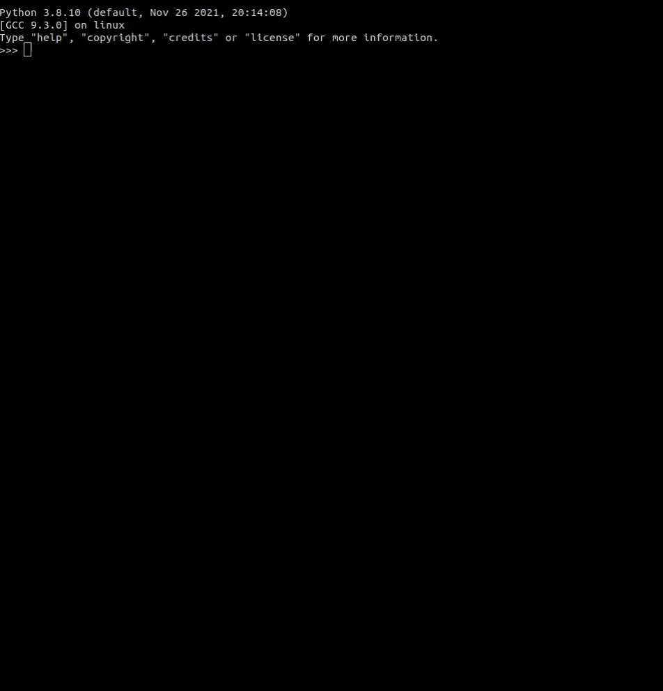

# Описание

Разборка украинского адреса на типы

> Read this in other language: [English](README.en.md), [Русский](README.md), [Український](README.ua.md)

# Требования
* python3
* spacy
* re
* pandas
* csv
* os
* signal
* threading

## Подготовка модели
```shell
python3 pretrain.py
```

## Создание модели
```shell
python3 train.py
```

## Обучить модель
```shell
python3 -m spacy train config/config.cfg --paths.train training/train.spacy --paths.dev training/test.spacy --output models
```

## Обучить более точнее модель
```shell
python3 -m spacy train config/config_acc.cfg --paths.train training/train.spacy --paths.dev training/test.spacy --output models
```

## Проверка модели
```shell
python3 example.py
```

### Создать файл описания модели
```shell
python3 -m spacy init fill-config config/base_config.cfg config/config.cfg
```

### Создать файл описания более точной модели
```shell
python3 -m spacy init fill-config config/base_config_acc.cfg config/config_acc.cfg
```

## Примеры
```python
import uaddresspacy

print(uaddresspacy.parse(", - полтавська чутівський жовтневе вул. -, буд. -, кв.,"))
# [('полтавська', 'Locality'), ('чутівський', 'CountyType'), ('жовтневе', 'Locality'), ('вул.', 'StreetType'), ('буд.', 'HouseNumberType'), ('кв.', 'ApartmentType')]
print(uaddresspacy.parse(", 01000 київ, місто київ, місто київ воровського, буд. 43-б, кв. 14,"))
# [('01000', 'PostCode'), ('київ', 'Region'), ('місто', 'LocalityType'), ('київ', 'Locality'), ('воровського', 'Street'), ('буд.', 'HouseNumberType'), ('43-б', 'HouseNumber'), ('кв.', 'ApartmentType'), ('14', 'Apartment')]
```


```sh
python3 pretrain.py
```


## Структура
| Файл                      | Описание                                      |
| :-------------            | :-------------                                |
| pretrain.py               | Подготовка данных для обучения модели         |
| train.py                  | Подготовка модели                             |
| example.py                | Получить пример разборки адреса на типы       |
| report.csv                | Пример результата обработки на типы           |
| addresses.csv             | Список адресов для проверки                   |
| training/raw.csv          | Данные для обучения                           |
| training/pretrain.csv     | Данные для обучения модели                    |

## Типы
| Название                  | Описание                                      |
| :-------------            | :-------------                                |
| Country                   | Страна                                        |
| RegionType                | Тип области                                   |
| Region                    | Область                                       |
| CountyType                | Тип района                                    |
| County                    | Район                                         |
| Included                  | Входит в состав                               |
| LocalityType              | Тип населённого пункта                        |
| Locality                  | Населённый пункт                              |
| StreetType                | Тип улицы                                     |
| Street                    | Улица                                         |
| HousingType               | Тип корпуса                                   |
| Housing                   | Корпус                                        |
| HostelType                | Тип общежития                                 |
| Hostel                    | Общежитие                                     |
| HouseNumberType           | Тип номера дома                               |
| HouseNumber               | Номер дома                                    |
| HouseNumberAdditionally   | Дополнительный номер дома                     |
| SectionType               | Тип секции                                    |
| Section                   | Секция                                        |
| ApartmentType             | Тип квартиры                                  |
| Apartment                 | Квартира                                      |
| RoomType                  | Тип комнаты                                   |
| Room                      | Комната                                       |
| Sector                    | Сектор                                        |
| FloorType                 | Тип этажа                                     |
| Floor                     | Этаж                                          |
| PostCode                  | Индекс                                        |
| Manually                  | Набор типов для дальнейшей разборки адреса    |
| NotAddress                | Не адрес                                      |
| Comment                   | Комментарий                                   |
| AdditionalData            | Дополнительные данные                         |